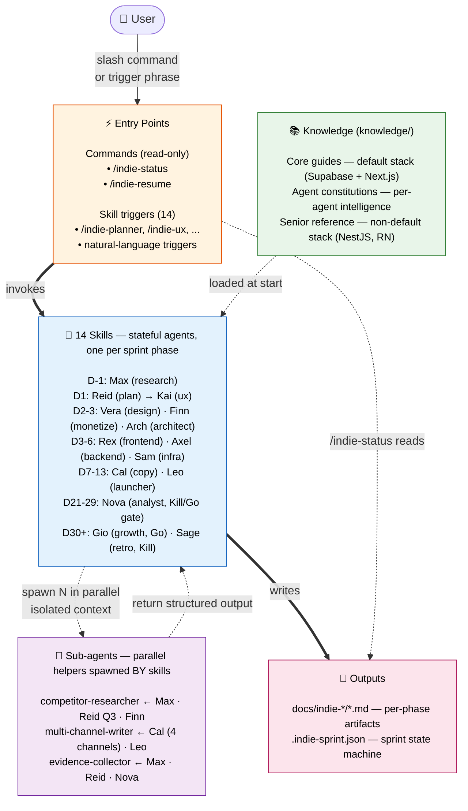
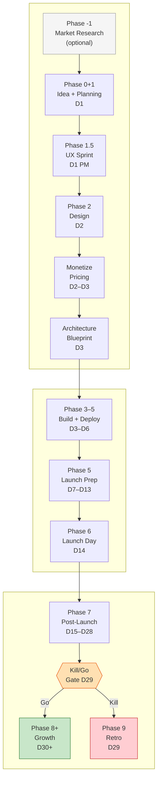
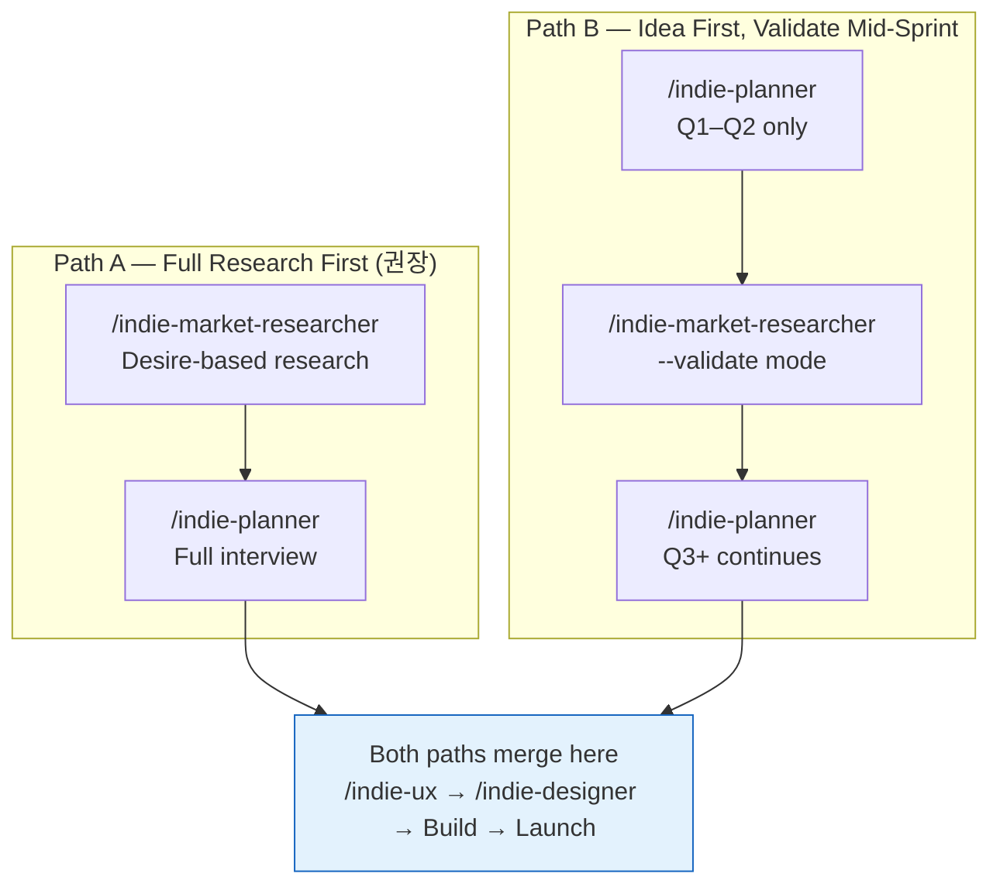
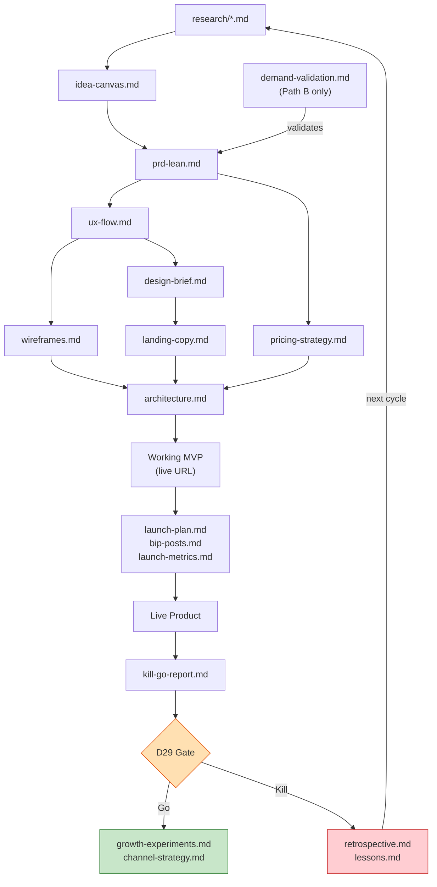
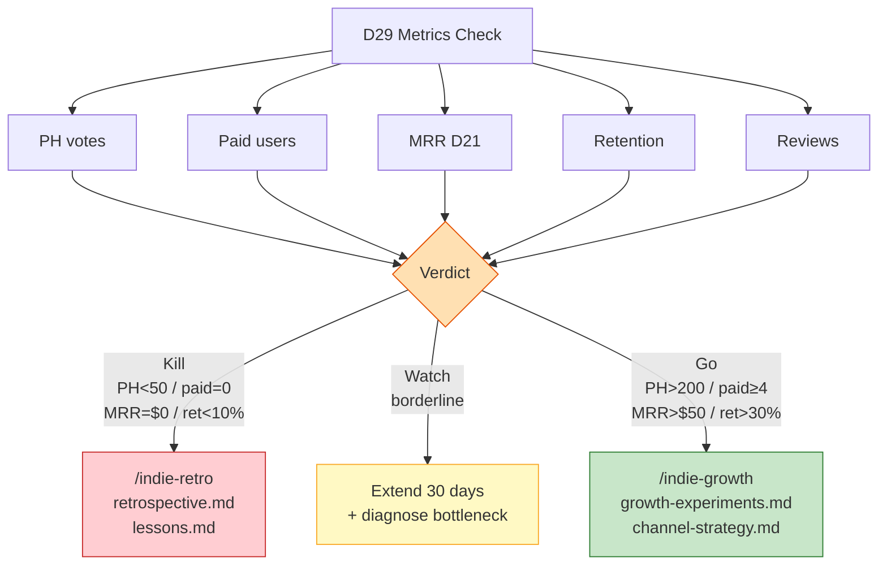
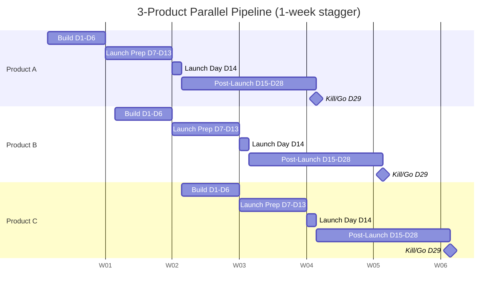

# Indie Maker

> AI-powered sprint system for indie makers — from idea to Kill/Go in 29 days.
> Powered by 14 specialized Claude Code skills covering every phase of the indie sprint.

---

## What is this?

A Claude Code skill system that automates the cognitive work of each sprint phase — market research, planning, UX, design, build, launch, and growth — so you can focus on judgment and execution.

**Target product stack**: Next.js + Tailwind + shadcn/ui + Supabase + Stripe + Vercel (Web SaaS)
**Runtime**: Claude Code (all skills run inside Claude Code sessions)
**Timeline**: D1-D6 (AI-accelerated) → D7-D29 (community/human-dependent)

---

## System Architecture (한눈에 보기)

5-layer architecture. Read top-to-bottom: who triggers, who runs, what they consult, who they delegate to, what gets produced.



### How to read it

| Layer | Role | Lives in |
|-------|------|----------|
| ⚡ **Entry Points** | Where the user starts. Commands are read-only utilities; skill triggers start conversational agents. | `.claude/commands/` + skill `trigger_phrases` |
| 🤖 **Skills** (14) | Stateful conversational agents, one per sprint phase. Own the artifact for that phase. | `skills/<name>/SKILL.md` |
| 📚 **Knowledge** | Reference docs loaded into skill context at start (best practices, frameworks, agent constitutions). | `knowledge/` |
| 🧩 **Sub-agents** | Isolated parallel workers spawned by skills for heavy WebSearch / multi-channel content / evidence gathering. Main skill's context stays clean. | `.claude/agents/` |
| 📄 **Outputs** | Markdown artifacts per phase + sprint state JSON tracked by hooks. | `docs/indie-*/` + `.indie-sprint.json` |

### Key arrows

- **Solid ⇒** = synchronous (skill writes file, command invokes skill)
- **Dashed ⇢** = async or non-blocking (sub-agent spawn returns later; knowledge load happens once)
- **Sub-agents return TO the calling skill** — they don't write outputs themselves; the skill merges and writes

**Why this matters**: heavy work (5 competitor WebSearches, 4-channel copy generation) runs in sub-agent contexts. The calling skill's main conversation stays focused on user decisions, not raw search dumps. Parallel dispatch = 2-5x speedup on multi-target work.

---

## Full Sprint Map



---

## Two Entry Paths



---

## Document Flow



---

## Skill Reference

| #   | Skill                      | Agent | Phase  | When to Run               | Output                                |
| --- | -------------------------- | ----- | ------ | ------------------------- | ------------------------------------- |
| 1   | `/indie-market-researcher` | Max   | -1     | Before any idea is set    | `docs/indie-market-researcher/`       |
| 2   | `/indie-planner`           | Reid  | 0+1    | D1 morning                | `docs/indie-planner/`                 |
| 3   | `/indie-ux`                | Kai   | 1.5    | D1 afternoon              | `docs/indie-ux/`                      |
| 4   | `/indie-designer`          | Vera  | 2      | D2                        | `docs/indie-designer/`                |
| 5   | `/indie-monetize`          | Finn  | 2–3 + 7 | D2–D3 (before Stripe code), D21+ (post-launch tune) | `docs/indie-monetize/` |
| 6   | `/indie-architect`         | Arch  | 2.5–3  | D3 morning (before build)  | `docs/indie-architect/`               |
| 7   | `/indie-frontend`          | Rex   | 3–5    | D3–D6 continuous          | — (interactive guide)                 |
| 8   | `/indie-backend`           | Axel  | 3–5    | D3–D6 continuous          | — (interactive guide)                 |
| 9   | `/indie-infra`             | Sam   | 3–5+6  | D6 QA + deploy            | — (guide + QA checklist)              |
| 10  | `/indie-copy`              | Cal   | 5      | D7, before indie-launcher | `docs/indie-copy/`                    |
| 11  | `/indie-launcher`          | Leo   | 5      | D7–D13                    | `docs/indie-launcher/`                |
| 12  | `/indie-analyst`           | Nova  | 7+Gate | D21–D29                   | `docs/indie-analyst/`                 |
| 13  | `/indie-growth`            | Gio   | 8+ Go  | D30+                      | `docs/indie-growth/`                  |
| —   | `/indie-retro`             | Sage  | 9 Kill | D29 Kill verdict          | `docs/indie-retro/`                   |

---

## Kill/Go Gate (D29)



---

## Parallel Pipeline (3 Products)



> Staggered 1 week → bi-weekly launch rhythm → up to 12 experiments/year

---

## Knowledge Base

### Core guides (referenced by SKILLs — default stack: Supabase + Next.js)

| Document                      | Content                                                     |
| ----------------------------- | ----------------------------------------------------------- |
| `knowledge/design-guide.md`   | Design system, WCAG AA, 8px grid, Atomic Design             |
| `knowledge/frontend-guide.md` | Next.js App Router, RSC rules, TypeScript strict, a11y      |
| `knowledge/backend-guide.md`  | Supabase, REST, OWASP Top 10, RLS patterns                  |
| `knowledge/infra-guide.md`    | Vercel, 12-Factor App, security hardening, observability    |
| `knowledge/automate-guide.md` | Email drip (Resend + pg_cron), Stripe webhooks, MRR view    |
| `knowledge/tech-stack.md`     | Canonical stack constraints — do not deviate without reason |

### Agent constitutions (extended intelligence per agent)

| Document                              | Used by | Content                                                          |
| ------------------------------------- | ------- | ---------------------------------------------------------------- |
| `knowledge/founding-pm-guide.md`      | Reid    | Customer Dev + Lean + JTBD frameworks, non-negotiable rules     |
| `knowledge/market-intelligence-guide.md` | Max  | Desire-based research, demand validation, competitive analysis  |
| `knowledge/analytics-guide.md`        | Nova    | AARRR, benchmarks, cohort analysis, growth experiment design    |
| `knowledge/full-stack-frontend.md`    | Rex     | Animation, URL state, multi-step forms, Zustand, v0.dev prompts |
| `knowledge/full-stack-backend.md`     | Axel    | Architecture trees, patterns library, performance, real-time    |
| `knowledge/full-stack-designer.md`    | Vera    | CRO, psychology, brand voice, microcopy, motion, critique       |

### Senior reference (non-default stack, learning use)

| Document                                            | Stack                       | Purpose                                         |
| --------------------------------------------------- | --------------------------- | ----------------------------------------------- |
| `knowledge/senior-reference/frontend-senior-guide.md` | Indie stack (deeper)         | Senior-level frontend with Philosophy + Decision Guide  |
| `knowledge/senior-reference/frontend-principles.md` | Next.js + RN + Apollo       | Larger-team frontend (JS fundamentals included) |
| `knowledge/senior-reference/backend-principles.md`  | NestJS + Postgres + BullMQ  | Non-Supabase backend (e.g. Pulse) — 1,700+ lines |

> SKILLs do NOT reference these; use for learning, interview prep, or non-default stack projects. See `knowledge/senior-reference/README.md`.

---

## Sub-agents & Commands

Beyond the 14 skills, the project includes specialized sub-agents (called BY skills for parallel work) and utility commands (for sprint management).

### Sub-agents (`.claude/agents/`)

| Sub-agent                | Called by             | Purpose                                                                       |
| ------------------------ | --------------------- | ----------------------------------------------------------------------------- |
| `competitor-researcher`  | Reid, Max, Finn       | Deep-dive one competitor — returns structured profile without context bloat   |
| `multi-channel-writer`   | Cal, Leo              | Per-channel copy generation (PH/HN/Reddit/X/email/landing) — parallel-friendly |
| `evidence-collector`     | Max, Reid, Nova       | Raw user-voice quote collection with source URLs — no synthesis               |

**Pattern**: caller builds shared brief → spawns N sub-agents in parallel → merges structured outputs.

### Commands (`.claude/commands/`)

| Command           | Purpose                                                                |
| ----------------- | ---------------------------------------------------------------------- |
| `/indie-status`   | Show sprint state across all projects + next recommended skill          |
| `/indie-resume`   | Auto-detect most recent project, summarize where you left off, suggest next |

---

## Sprint Principles

1. **Kill criteria first** — set the D29 numbers before writing a line of code
2. **Pre-sale before build** — 3+ people pay → build; 0 pay → don't build
3. **Validate demand before building** — use `/indie-market-researcher --validate` if skipping full research
4. **One core flow only** — anything else goes to `backlog.md`
5. **Ship when it works** — perfection is the enemy of launch
6. **Automate after $100 MRR** — manual before that, or you're optimizing too early
7. **Kill = data, not failure** — run `/indie-retro` to extract learning for the next sprint

---

## Getting Started

```bash
# Option A: Start with market research (recommended)
/indie-market-researcher

# Option B: Start with an idea you already have
/indie-planner

# Mid-sprint: validate demand before committing to build
/indie-market-researcher --validate

# Need help at a specific phase?
/indie-ux           # UX + wireframes
/indie-designer     # Brand + landing copy
/indie-monetize     # Pricing strategy + first paying customer
/indie-architect    # Architecture blueprint (run before build)
/indie-backend      # Supabase + Stripe + API questions
/indie-copy         # CRO copywriting (landing, channel posts, email drip)
/indie-launcher     # PH + Reddit + HN + Discord launch system
/indie-analyst      # Kill/Go analysis (run D21–D29)
```

---

## Reference

- [`ROADMAP.md`](ROADMAP.md) — Release milestones (v0.1 → v0.2 → v0.3)
- [`docs/exec-plans/active/`](docs/exec-plans/active/) — Active execution plans (work in progress)
- [`indie-sprint-playbook.md`](indie-sprint-playbook.md) — Detailed phase-by-phase playbook
- [`CLAUDE.md`](CLAUDE.md) — Skill scope and system instructions
- [`knowledge/`](knowledge/) — Technical reference documents
