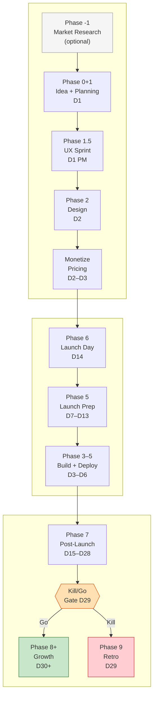
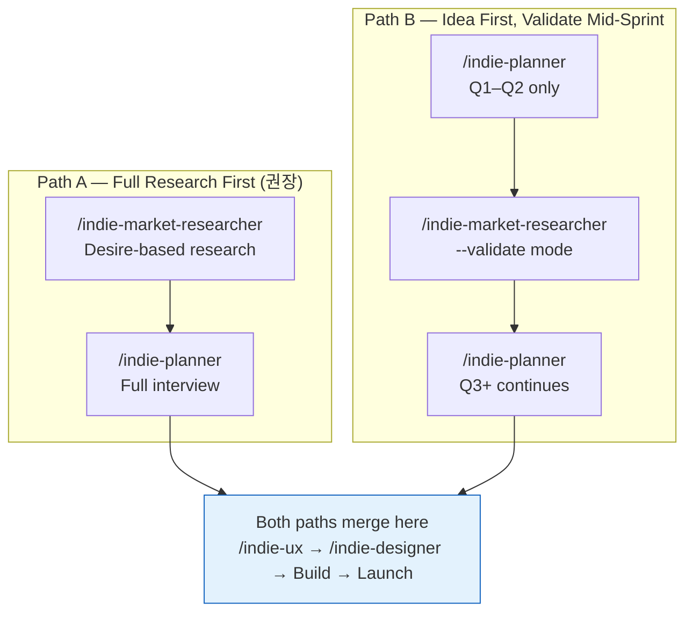
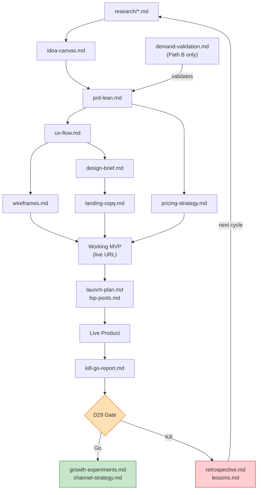
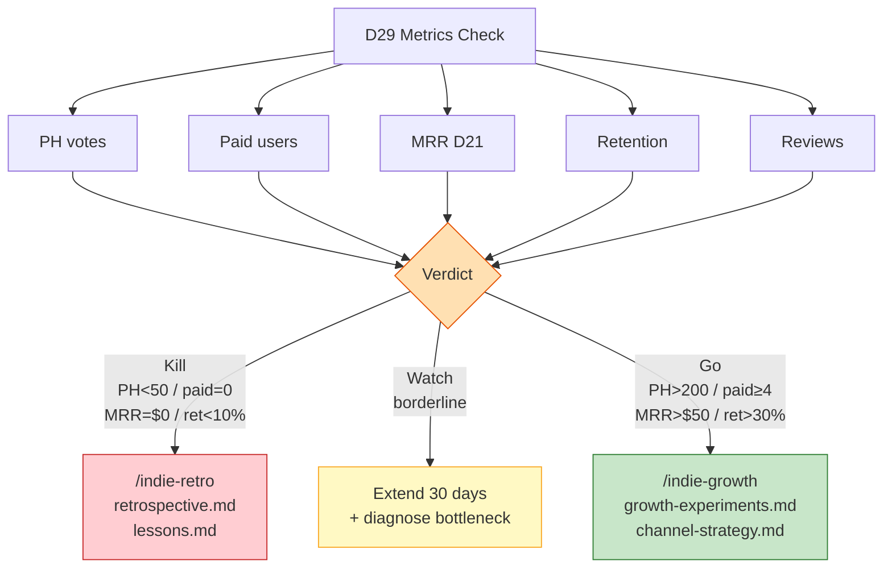
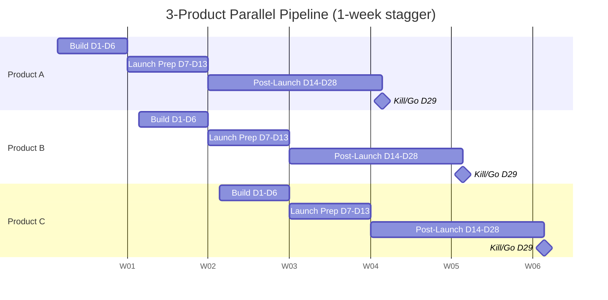

# Indie Maker

> AI-powered sprint system for indie makers — from idea to Kill/Go in 29 days.
> Powered by 12 specialized Claude Code skills covering every phase of the indie sprint.

---

## What is this?

A Claude Code skill system that automates the cognitive work of each sprint phase — market research, planning, UX, design, build, launch, and growth — so you can focus on judgment and execution.

**Target product stack**: Next.js + Tailwind + shadcn/ui + Supabase + Stripe + Vercel (Web SaaS)
**Runtime**: Claude Code (all skills run inside Claude Code sessions)
**Timeline**: D1-D6 (AI-accelerated) → D7-D29 (community/human-dependent)

---

## Full Sprint Map



---

## Two Entry Paths



---

## Document Flow



---

## Skill Reference

| #   | Skill                      | Agent | Phase  | When to Run               | Output                                |
| --- | -------------------------- | ----- | ------ | ------------------------- | ------------------------------------- |
| 1   | `/indie-market-researcher` | Max   | -1     | Before any idea is set    | `docs/indie-market-researcher/`       |
| 2   | `/indie-planner`           | Reid  | 0+1    | D1 morning                | `docs/indie-planner/`                 |
| 3   | `/indie-ux`                | Kai   | 1.5    | D1 afternoon              | `docs/indie-ux/`                      |
| 4   | `/indie-designer`          | Vera  | 2      | D2                        | `docs/indie-designer/`                |
| 5   | `/indie-monetize`          | Finn  | 2–3    | D2–D3, before Stripe code | `docs/indie-monetize/`                |
| 6   | `/indie-frontend`          | Rex   | 3–5    | D3–D6 continuous          | — (interactive guide)                 |
| 7   | `/indie-backend`           | Axel  | 3–5    | D3–D6 continuous          | — (interactive guide)                 |
| 8   | `/indie-infra`             | Sam   | 3–5+6  | D6 QA + deploy            | — (guide + QA checklist)              |
| 9   | `/launch-kit`              | —     | 5      | D7, before indie-launcher | `launch-kit-output.md`                |
| 10  | `/indie-launcher`          | Leo   | 5      | D7–D13                    | `docs/indie-launcher/`                |
| 11  | `/indie-analyst`           | Nova  | 7+Gate | D21–D29                   | `docs/indie-analyst/`                 |
| 12  | `/indie-growth`            | Gio   | 8+ Go  | D30+                      | `docs/indie-growth/`                  |
| —   | `/indie-retro`             | Sage  | 9 Kill | D29 Kill verdict          | `docs/indie-retro/`                   |

---

## Kill/Go Gate (D29)



---

## Parallel Pipeline (3 Products)



> Staggered 1 week → bi-weekly launch rhythm → up to 12 experiments/year

---

## Knowledge Base

| Document                      | Content                                                     |
| ----------------------------- | ----------------------------------------------------------- |
| `knowledge/design-guide.md`   | Design system, WCAG AA, 8px grid, Atomic Design             |
| `knowledge/frontend-guide.md` | Next.js App Router, RSC rules, TypeScript strict, a11y      |
| `knowledge/backend-guide.md`  | Supabase, REST, OWASP Top 10, RLS patterns                  |
| `knowledge/infra-guide.md`    | Vercel, 12-Factor App, security hardening, observability    |
| `knowledge/automate-guide.md` | Email drip (Resend + pg_cron), Stripe webhooks, MRR view    |
| `knowledge/tech-stack.md`     | Canonical stack constraints — do not deviate without reason |

---

## Sprint Principles

1. **Kill criteria first** — set the D29 numbers before writing a line of code
2. **Pre-sale before build** — 3+ people pay → build; 0 pay → don't build
3. **One core flow only** — anything else goes to `backlog.md`
4. **Ship when it works** — perfection is the enemy of launch
5. **Automate after $100 MRR** — manual before that, or you're optimizing too early
6. **Kill = data, not failure** — run `/indie-retro` to extract learning for the next sprint

---

## Getting Started

```bash
# Option A: Start with market research (recommended)
/indie-market-researcher

# Option B: Start with an idea you already have
/indie-planner

# Mid-sprint: validate demand before committing to build
/indie-market-researcher --validate

# Need help at a specific phase?
/indie-ux           # UX + wireframes
/indie-designer     # Brand + landing copy
/indie-monetize     # Pricing strategy + first paying customer
/indie-backend      # Supabase + Stripe + API questions
/indie-launcher     # PH + Reddit + HN + Discord launch system
/indie-analyst      # Kill/Go analysis (run D21–D29)
```

---

## Reference

- [`indie-sprint-playbook.md`](indie-sprint-playbook.md) — Detailed phase-by-phase playbook
- [`CLAUDE.md`](CLAUDE.md) — Skill scope and system instructions
- [`knowledge/`](knowledge/) — Technical reference documents
